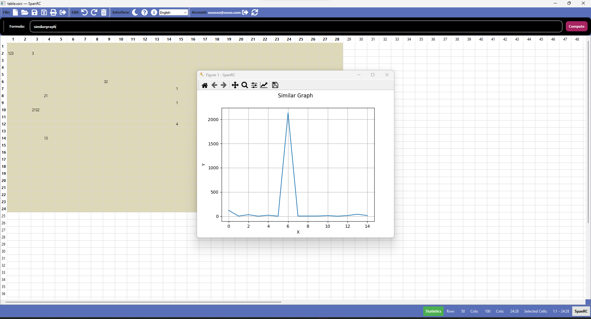

# SpanRC - A Table Processor

SpanRC is a table processor. It is written in Python and uses the PyQt5 library for the graphical user interface. It is cross-platform and can be used on Windows, macOS, and Linux. It is designed to be a simple alternative to other table processors. It is lightweight and easy to use.

## Screenshots

### Features

- [x] Open CSV & XSRC files (SpanRC Files)
- [x] Save CSV & XSRC files (SpanRC Files)
- [x] Print (Export to PDF)
- [x] Edit tables
- [x] Formula support (avg, sum, min, max, count, similargraph, etc.)
- [x] Delete, edit rows and columns
- [x] Customizable toolbar
- [x] Fast and lightweight
- [x] Threading support
- [x] Unsaved changes warning
- [x] Dark/Light mode support
- [x] Real-time statistics (row count, column count, cell count, etc.)
- [x] Multi language (English, Turkish, German, Spanish, Azerbaijani)
- [x] Cross-platform (Windows, macOS, Linux)

### Prerequisites

- Python 3.6+
- PyQt5

### Contributing

Contributions to the RichSpan project are welcome. Please read [CONTRIBUTING.md](CONTRIBUTING.md) for details on our code of conduct, and the process for submitting pull requests.

### License

This project is licensed under the Apache License 2.0 - see the [LICENSE](LICENSE) file for details.
